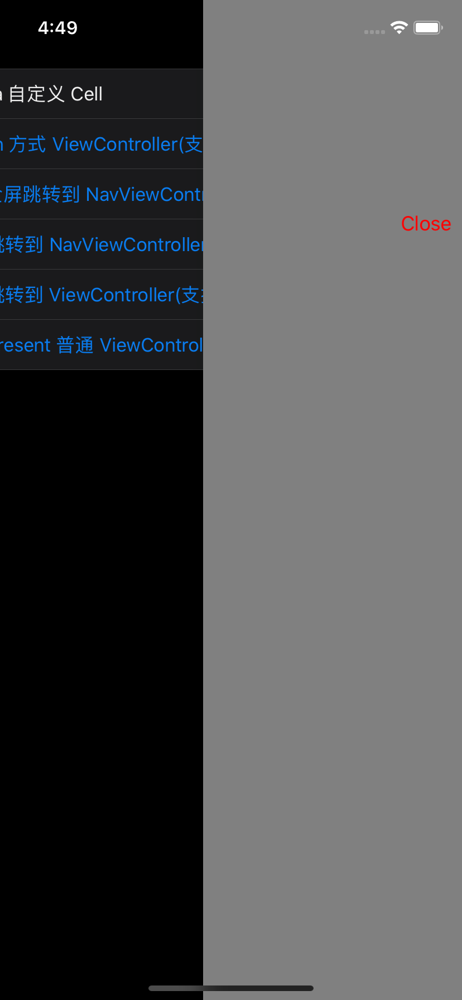

EurekaSwift
===

*  主要测试 Eureka 的一些自定义
*  [HWPanModal](https://github.com/HeathWang/HWPanModal) 的全屏显示
    *  HWPanModal 一个非常好用的第三方库

> 注释均在: BaseViewController.swift

* 解决去除导航栏,或者自定义返回按钮导致右滑手势失效问题
* 如何让导航栏随页面一起移动，而不是淡入淡出?

截图
===

